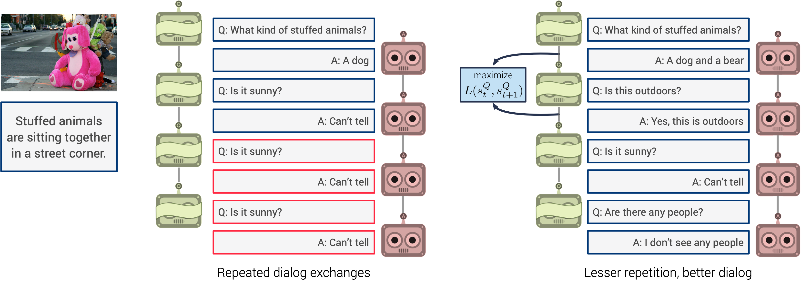

# Visdial-Diversity

PyTorch implementation of the paper:

**[Improving Generative Visual Dialog by Answering Diverse Questions](https://arxiv.org/pdf/1909.10470.pdf)**  
Vishvak Murahari, Prithvijit Chattopadhyay, Dhruv Batra, Devi Parikh, Abhishek Das  
<https://arxiv.org/pdf/1909.10470.pdf>  
EMNLP 2019

Prior work on training generative Visual Dialog models with reinforcement learning(Das et al. 2017) has explored a Qbot-Abot image-guessing game and shown that this 'self-talk' approach can lead to improved performance at the downstream dialog-conditioned image-guessing task. However, this improvement saturates and starts degrading after a few rounds of interaction, and does not lead to a better Visual Dialog model. We find that this is due in part to repeated interactions between Qbot and Abot during self-talk, which are not informative with respect to the image. To improve this, we devise a simple auxiliary objective that incentivizes Qbot to ask diverse questions, thus reducing repetitions and in turn enabling Abot to explore a larger state space during RL ie. be exposed to more visual concepts to talk about, and varied questions to answer. We evaluate our approach via a host of automatic metrics and human studies, and demonstrate that it leads to better dialog, ie. dialog that is more diverse (ie. less repetitive), consistent (ie. has fewer conflicting exchanges), fluent (ie. more human-like),and detailed, while still being comparably image-relevant as prior work and ablations.

This repository contains code for reproducing the key results mentioned in the paper. All results are on v1.0 of the Visual Dialog dataset. We provide checkpoints (to reproduce results) and the associated configs to train these checkpoints from scratch.

This code is an adaptation of <https://github.com/batra-mlp-lab/visdial-rl> and we thank them for open sourcing their code and expediting our progress on this project.
We also thank the developers of <https://github.com/batra-mlp-lab/visdial-challenge-starter-pytorch> whose implementaiton we have adapted for our NDCG calculations.



Table of Contents
=================

   * [Setup and Dependencies](#setup-and-dependencies)
   * [Usage](#usage)
      * [Download preprocessed data](#download-preprocessed-data)
      * [Pre-trained checkpoints](#pre-trained-checkpoints)
      * [Training](#training)
      * [Logging](#logging)
      * [Evaluation](#evaluation)
      * [Visualizing Results](#visualizing-results)
   * [Reference](#reference)
   * [License](#license)

## Setup and Dependencies

Our code is implemented in PyTorch (v0.3.1). To setup, do the following:

1. Install [Python 3.6](https://www.python.org/downloads/release/python-365/)
2. Get the source:
```
git clone https://github.com/vmurahari3/visdial-diversity.git visdial-diversity
```
3. Install requirements into the `visdial-diversity` virtual environment, using [Anaconda](https://anaconda.org/anaconda/python):
```
conda env create -f env.yml
```

## Usage

Make both the scripts in `scripts/` executable

```
chmod +x scripts/download_preprocessed.sh
chmod +x scripts/download_checkpoints.sh
```
### Download preprocessed data

Download preprocessed dataset and extracted features:

```
sh scripts/download_preprocessed.sh
```

### Pre-trained checkpoints

Download pre-trained checkpoints:

```
sh scripts/download_checkpoints.sh
```

### Training

After running the above scripts, all the pre-processed data is downloaded to `data/visdial` and all the pre-trained model checkpoints used in the paper are downloaded to `checkpoints-release`

Here we list the training arguments to train the checkpoints in `checkpoints-release`.

For SL  pre-training:

`SL: Diverse-Q-Bot `

```
python train.py -cocoDir <path to coco/images > -cocoInfo <path to coco.json> -dropout 0.5 -useGPU -featLossCoeff 1000 -CELossCoeff 0.1 -trainMode sl-qbot -useHuberLoss 1 -HuberLossCoeff 0.007 -saveName SL_Div_QBot 
```

`SL: Q-Bot `

```
python train.py -cocoDir <path to coco/images > -cocoInfo <path to coco.json> -useGPU -featLossCoeff 1000 -CELossCoeff 1 -trainMode sl-qbot -saveName SL_QBot 
```

`SL: A-Bot `

```
python train.py -cocoDir <path to coco/images > -cocoInfo <path to coco.json> -useGPU -featLossCoeff 1000 -CELossCoeff 1 -trainMode sl-abot -saveName SL_ABot 
```

For RL fine-tuning:

`Baseline (Das et. al 2017)`
```
python train.py -cocoDir <path to coco/images > -cocoInfo <path to coco.json> -dropout 0 -useGPU -useNDCG  -startFrom checkpoints-release/SL_ABOT.vd -qstartFrom checkpoints-release/SL_QBOT.vd  -RLLossCoeff 1 -featLossCoeff 10000 -CELossCoeff 100 -rlAbotReward 1 -useCurriculum 1 -trainMode rl-full-QAf -saveName RL-Baseline-Das-etal
```

`RL:Diverse-Qbot-Abot`
```
python train.py -cocoDir <path to coco/images > -cocoInfo <path to coco.json> -dropout 0 -useGPU -useNDCG  -startFrom checkpoints-release/SL_ABOT.vd -qstartFrom checkpoints-release/SL_DIV_QBOT.vd  -RLLossCoeff 1 -featLossCoeff 10000 -CELossCoeff 100 -rlAbotReward 1 -useCurriculum 1 -trainMode rl-full-QAf -saveName RL-Diverse-QBot-ABot
```

### Evaluation
This section lists the set of commands to generate the numbers in `Table 1` and `Table 2` in the paper.

The set of commands to generate diversity metrics in `Table 1`.

```
python evaluate.py -useGPU \
    -startFrom checkpoints-release/ICCV_RL_ABOT.vd \
    -qstartFrom checkpoints-release/ICCV_RL_QBOT.vd \
    -evalMode dialog \
    -beamSize 5 \
    -savePath dialog_output \
    -saveName Baseline-Das-et-al
    -cocoInfo  <path to coco.json> \
    -cocoDir  <path to coco/images>

```

```
python evaluate.py -useGPU \
    -startFrom checkpoints-release/SL_ABOT.vd \
    -qstartFrom checkpoints-release/SL_QBOT.vd \
    -evalMode dialog \
    -beamSize 5 \
    -savePath dialog_output \
    -saveName SL-QBOT-ABOT \
    -cocoInfo  <path to coco.json> \
    -cocoDir  <path to coco/images>

```
```
python evaluate.py -useGPU \
    -startFrom checkpoints-release/SL_ABOT.vd \
    -qstartFrom checkpoints-release/SL_DIV_QBOT.vd \
    -evalMode dialog \
    -beamSize 5 \
    -savePath dialog_output \
    -saveName SL_Div-QBOT-ABOT \
    -cocoInfo  <path to coco.json> \
    -cocoDir  <path to coco/images>

```

```
python evaluate.py -useGPU \
    -startFrom checkpoints-release/RL_DIV_ABOT.vd \
    -qstartFrom checkpoints-release/RL_DIV_QBOT.vd \
    -evalMode dialog \
    -beamSize 5 \
    -savePath dialog_output \
    -saveName RL-Diverse-Qbot-A-Bot \
    -cocoInfo  <path to coco.json> \
    -cocoDir  <path to coco/images>
```

Running these 4 commands will generate 4 folders in the `dialog_output` directory. Inside each folder, you will find `metrics.txt` which contains a dump of all the relevant metrics. You will also find `results.json` which can be used to visualize results. More on visualization in ["Visualizing Results"](#visualizing-results)

For generating Visual Dialog metrics on v1.0 val in `Table 2`, run the following commands,

```
python evaluate.py -useGPU -useNDCG \
    -startFrom checkpoints-release/ICCV_RL_ABOT.vd \
    -evalMode ABotRank \
    -beamSize 5 \
    -cocoInfo  <path to coco.json> \
    -cocoDir  <path to coco/images>

```

```
python evaluate.py -useGPU -useNDCG \
    -startFrom checkpoints-release/SL_ABOT.vd \
    -evalMode ABotRank \
    -beamSize 5 \
    -cocoInfo  <path to coco.json> \
    -cocoDir  <path to coco/images>

```
```
python evaluate.py -useGPU -useNDCG \
    -startFrom checkpoints-release/RL_DIV_ABOT.vd \
    -evalMode ABotRank \
    -beamSize 5 \
    -cocoInfo  <path to coco.json> \
    -cocoDir  <path to coco/images>

```

Running the following commands will produce the following numbers:

| Checkpoint                             | Mean  Rank | MRR   | R1    | R5    | R10   | NDCG  |
|:--------------------------------------:|:----------:|:-----:|:-----:|:-----:|:-----:|:-----:|
| RL: ICCV ABOT (Das et. al 2017)       | 19.52      | 46.40 | 36.30 | 56.22 | 62.60 | 53.73 |
| SL: ABOT                               | 19.58      | 46.21 | 36.11 | 55.82 | 62.22 | 53.10 |
| RL: ABOT (Finetuned with Diverse QBOT) | 19.35      | 46.46 | 36.31 | 56.26 | 62.53 | 53.91 |


For generating Visual Dialog metrics on v1.0 test-std in `Table 2`, run the following commands to generate `predictions.txt` and submit to the test server at <https://visualdialog.org/challenge/2018>


```
python evaluate.py -useGPU -useNDCG  -evalSplit test\
    -startFrom checkpoints-release/ICCV_RL_ABOT.vd \
    -evalMode ABotRank \
    -beamSize 5 \
    -cocoInfo  <path to coco.json> \
    -cocoDir  <path to coco/images>

```

```
python evaluate.py -useGPU -useNDCG -evalSplit test \
    -startFrom checkpoints-release/SL_ABOT.vd \
    -evalMode ABotRank \
    -beamSize 5 \
    -cocoInfo  <path to coco.json> \
    -cocoDir  <path to coco/images>

```
```
python evaluate.py -useGPU -useNDCG -evalSplit test\
    -startFrom checkpoints-release/RL_DIV_ABOT.vd \
    -evalMode ABotRank \
    -beamSize 5 \
    -cocoInfo  <path to coco.json> \
    -cocoDir  <path to coco/images>

```

If you wish to reproduce our human study, the files in `data/human_study` are relevant. `data/human_study/indices.csv` which contains 200 indices indexing into the test split. These are the images on which dialog was generated for the different variants. '`data/human_study/img_pool.json` maps these 200 images to a set of 20 images. The first 6 images are the 6 images closest to the given image in the test split of the visual dialog dataset. These first 6 images are in order of decreasing similarity. Therefore, the first image is the given image itself :). The rest of the 14 images are randomly selected from the rest of the test split of the visual dialog dataset.

To generate a json file containing Q-Bot and A-Bot dialog exchange on these 200 images along with the corresponding pool of 20 images, run the following command:

```
python evaluate.py -useGPU \
    -startFrom <Path to A-Bot checkpoint> \
    -qstartFrom <Path to Q-Bot checkpoint> \
    -evalMode human_study \
    -cocoDir /path/to/coco/images/ \
    -cocoInfo /path/to/coco.json \
    -beamSize 5
```

### Logging

Please look at <https://github.com/batra-mlp-lab/visdial-rl#logging>.


### Visualizing Results

To generate dialog for visualization, run `evaluate.py` with `evalMode` set to `dialog`.

```
python evaluate.py -useGPU \
    -startFrom <Path to A-Bot checkpoint> \
    -qstartFrom <Path to Q-Bot checkpoint> \
    -evalMode dialog \
    -cocoDir /path/to/coco/images/ \
    -cocoInfo /path/to/coco.json \
    -beamSize 5
```
Note: For more examples refer to the ["Evaluation section"](#evaluation)
Place the generated `results.json` file in `dialog_output/results/`. Now to visualize the generated dialog, run:
```
cd dialog_output/
python -m http.server 8000
```

Navigate to `localhost:8000`. The page should look as follows:


## Reference

If you use this code as part of any published research,  please cite this repo as well as Murahari et. al.,Improving Generative Visual Dialog by Answering Diverse Questions.

```
@misc{modhe2018visdialrlpytorch
   author = {Modhe, Nirbhay and Prabhu, Viraj and Cogswell, Michael and Kottur, Satwik and Das, Abhishek and Lee, Stefan and Parikh, Devi and Batra, Dhruv },
   title = {VisDial-RL-PyTorch},
   year = {2018},
   publisher = {GitHub}.
   journal = {GitHub repository},
   howpublished = {\url{https://github.com/batra-mlp-lab/visdial-rl.git}}
}

@inproceedings{murahari2019visdialdiversity,
  title={Improving Generative Visual Dialog by Answering Diverse Questions},
  author={Vishvak Murahari, Prithvijit Chattopadhyay, Dhruv Batra, Devi Parikh, Abhishek Das},
  booktitle={Proceedings of the 2019 Conference on Empirical Methods in Natural Language Processing},
  year={2019}
}
```

## Acknowledgements

We thank Nirbhay Modhe and Viraj Prabhu for their PyTorch implementation(<https://github.com/batra-mlp-lab/visdial-rl>) 
of <https://arxiv.org/abs/1703.06585> that we built on, and Jiasen
Lu for helpful discussions.
## License

BSD
